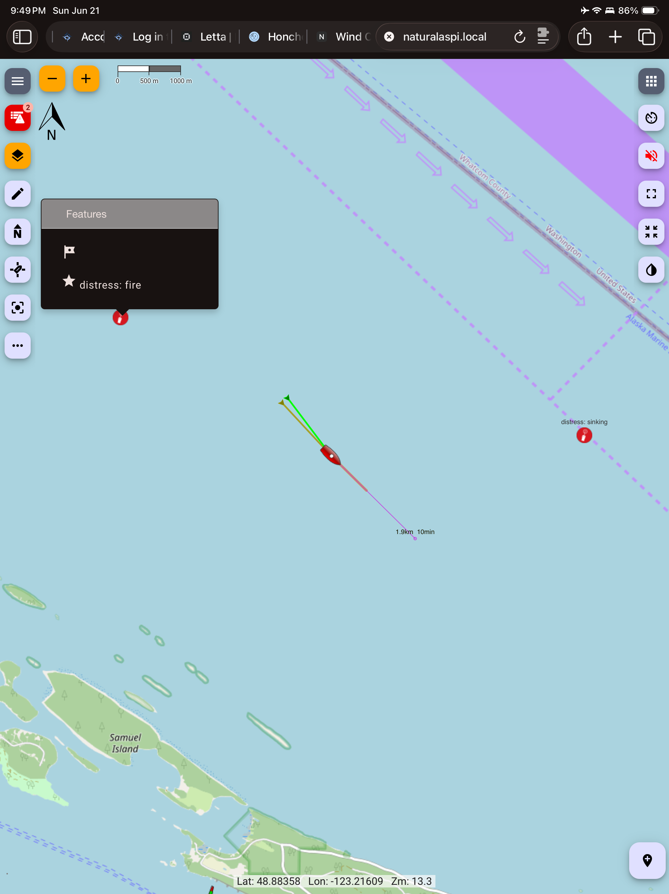

# @sailingnaturali/signalk-dsc

SignalK plugin that receives, logs, and alerts on **DSC** (VHF digital selective
calling) traffic — distress, urgency, safety, and routine calls — from both
**NMEA 0183** (`$--DSC`/`$--DSE`) and **NMEA 2000** (PGN 129808).

## Why

When a vessel hits the red button, its radio broadcasts a DSC burst on channel 70
with MMSI, position, and nature of distress — perfectly readable even when the
follow-up voice call on 16 is not. Stock SignalK mostly drops this data: the 0183
hook misses common sentence variants and persists nothing, and the N2K converter
has **no** PGN 129808 mapping at all. If you might be the nearest boat, you want
every received alert stored with its position and surfaced as an alarm — that is
this plugin.

Logging that traffic is also the regulatory standard. Maritime radio rules
require *compulsorily-equipped* vessels to record every distress, urgency, and
safety call **made or intercepted**, with the time and position of the station
in distress ([47 CFR §80.409](https://www.law.cornell.edu/cfr/text/47/80.409);
SOLAS Ch. IV; ITU Radio Regulations; Canada's TP 1539). Pleasure craft are
generally exempt from the log mandate — this just gives you that same
SOLAS-grade record automatically. The parser gaps and the regulation are written
up in more detail [on the engineering blog][writeup].

[writeup]: https://engineering.sailingnaturali.com/signalk-dsc-distress-call-logging-nmea0183-dse-pgn-129808/

## What you get

For every DSC call heard by a connected radio:

- **A persistent call log** — JSONL on disk, served at
  `GET /signalk/v2/api/resources/dsc-calls` (anonymously readable when the server
  allows read-only access). Raw sentence/PGN is always kept alongside the parsed
  fields: time, MMSI, category, nature of distress, position, UTC time.
- **A chart-marker layer** — `GET /signalk/v2/api/resources/dsc-call-markers`
  serves logged calls as [Freeboard-SK](https://github.com/SignalK/freeboard-sk)
  ResourceSets, one per category (distress/urgency/safety/routine), each a
  GeoJSON `FeatureCollection` of Point markers whose popup carries the nature,
  caller name/MMSI, and times. To use it in Freeboard: Settings → Resources
  (Custom) → add resource type `dsc-call-markers`, reload, then toggle the
  per-category layers. Non-distress calls drop off after `markerWindowHours`
  (default 24); an active (un-cleared) distress call stays until you clear the alarm.
  This is the *detail* layer — distinct from the prominent live SaR marker a
  distress call also draws via the `sar.` context (see Remote-vessel deltas).

  

- **Alarms under your own vessel** — `notifications.dsc.distress` (state
  `emergency`), `notifications.dsc.urgency` (`alarm`), `notifications.dsc.safety`
  (`alert`). Routine calls never alarm. Repeated re-transmissions of the same
  alert (DSC auto-repeats until acknowledged) update the stored call instead of
  re-alarming. Alerts received within the last hour are **re-raised after a
  server restart** — notifications are in-memory, and a received MAYDAY must
  not vanish because the server bounced.
- **A voice-sized message** — the notification message is deliberately minimal
  (type, vessel, situation, range and direction from own position, action):
  > DSC distress alert: vessel Wind Chaser, sinking, 2.3 nautical miles
  > northwest. Monitor channel 16.

  Full detail (MMSI, coordinates, reported time, transport) goes to the call
  log and the logbook entry instead, so TTS pipelines stay terse.
- **Remote-vessel deltas** — the caller's `navigation.position` (and a distress
  notification) under the caller's context, so chartplotters can show where the
  call came from. A **distress** caller is emitted under the Search-and-Rescue
  context `sar.urn:mrn:imo:mmsi:<caller>` — which plotters like
  [Freeboard-SK](https://github.com/SignalK/freeboard-sk) render as a distress
  (SaR) target rather than an ordinary AIS vessel; every other category stays
  under `vessels.urn:mrn:imo:mmsi:<caller>`.
- Every stored call carries an `ownShip` snapshot of the moment it arrived —
  position, course, heading, speed, wind, pressure, and (when a source publishes them)
  sea state, visibility, and cloud coverage. Absent sensor, absent field.
- Logbook entries are written with `vhf: "70"` (DSC is received on channel 70
  by definition) plus structured `observations`; non-distress calls that
  propose a working channel get it in the entry text and on the stored event
  as `workingChannel`.
- **Optional ship's-log entries** via
  [signalk-logbook](https://github.com/meri-imperiumi/signalk-logbook) — a
  GMDSS-style radio log of received distress/urgency/safety traffic.

> **Note:** Visibility on `environment.outside.visibility` is read as meters
> and converted to the logbook 0–9 fog scale; an integer value ≤ 9 is assumed
> to already be a fog-scale code, so sub-10-meter metric readings would be
> misread.

## Transports

- **NMEA 0183**: registers custom `DSC` and `DSE` sentence parsers (these replace
  the server's stock DSC hook with a superset: tolerant of sparse distress alerts
  some radios emit — see [nmea0183-signalk#217](https://github.com/SignalK/nmea0183-signalk/issues/217)
  — and with `DSE` position refinement from ±1 NM to ten-thousandths of a minute,
  which the stock parser ignores entirely).
- **NMEA 2000**: listens to the server's analyzer stream (`N2KAnalyzerOut`) for
  PGN 129808, since `n2k-signalk` produces no delta for it.

## Configuration

| Option | Default | Notes |
| --- | --- | --- |
| `maxEvents` | `1000` | Oldest calls dropped beyond this. |
| `markerWindowHours` | `24` | Non-distress calls leave the `dsc-call-markers` chart layer after this many hours; active distress stays until cleared. |
| `logbookEnabled` | `true` | Requires signalk-logbook and a token. |
| `logbookRoutine` | `false` | Also log routine calls. |
| `logbookUrl` | `http://localhost:3000/plugins/signalk-logbook/logs` | |
| `logbookToken` | _empty_ | SignalK access token; logbook writes are skipped without one (plugin routes are auth-gated). |
| `snapshotPaths` | `[]` | Extra `{ field, path }` pairs added to the `ownShip` snapshot on each stored call (position, course, heading, speed, wind, pressure, sea state, visibility and cloud coverage are always attempted). |

## Trying it without a radio

### Quick test script

The repo includes a script that builds a valid DSC sentence and fires it at the
server over UDP. First add a UDP input in your SignalK pipedProviders (Settings →
Connections → Add):

```json
{
  "id": "dsc-test-udp",
  "pipeElements": [{ "type": "providers/simple",
    "options": { "type": "NMEA0183", "subOptions": { "type": "udp", "port": "7777" } } }]
}
```

Then send a fake distress call:

```bash
# Default: sinking, MMSI 366191919, near Boundary Pass → naturalaspi.local:7777
node scripts/send-test-dsc.js

# npm alias
npm run send-test-dsc

# Different nature of distress
node scripts/send-test-dsc.js --nature fire
node scripts/send-test-dsc.js --nature mob --category urgency

# Different vessel / position
node scripts/send-test-dsc.js --mmsi 316555777 --lat 48.9 --lon -123.5

# Different host / port
node scripts/send-test-dsc.js --host localhost --port 7777
```

All `--nature` values: `fire`, `flooding`, `collision`, `grounding`, `listing`,
`sinking`, `adrift`, `abandon`, `piracy`, `mob`, `epirb`.

Verify the call was captured:

```
GET /signalk/v2/api/resources/dsc-calls
```

### Manual sentence injection

You can also feed raw sentences through any NMEA 0183 connection (TCP, UDP, file
playback):

```
$CDDSC,12,3380400790,12,05,00,1423108312,2019,,,S,E*69
$CDDSE,1,1,A,3380400790,00,45894494*1B
```

### Clearing an alarm

A received distress/urgency/safety call raises `notifications.dsc.<category>` and is
re-raised for up to an hour across server restarts. To clear an active alarm — dropping
the live notification and stopping the restart re-raise:

```bash
SIGNALK_TOKEN=<readwrite-token> npm run clear-dsc -- --category distress
```

`--category all` clears all three. Clearing is a write, so it needs a readwrite token
(the same one used to fire a test MOB). A new incoming call still alarms normally.
This clears the `self`-context alarm; the transient per-caller notification raised under
the sender's vessel context is not persisted or re-raised, so it is left untouched.

## Limitations

- Distress relays, acknowledgements, and cancellations are stored (with
  `acknowledgement`/`distressedMmsi` fields) but don't yet clear or transform the
  original alarm.
- Multi-sentence `DSE` groups are ignored (single-sentence covers Class-D gear).
- A raised distress notification stays active until cleared from the server —
  deliberate: a received MAYDAY should not silently expire.

## Future work

This plugin is **receive-only**: it reads, logs, and alarms on DSC calls a radio
puts on the bus, and never transmits. The obvious next capability is the *write*
path — initiating a DSC call from SignalK, e.g. relaying a MAYDAY or sending a
distress/MOB alert *to* the radio to broadcast.

The blocker is hardware, not software. Almost no marine VHF exposes an interface
to be **commanded to transmit** a DSC call:

- NMEA 0183 radios take a GPS position *in* and emit received calls *out*, but
  there's no standard sentence to initiate a transmission.
- On NMEA 2000, PGN 129808 carries received call info; there's no
  widely-implemented PGN to command a transmit. Where "send distress from the
  chartplotter" exists at all, it's proprietary same-vendor MFD↔radio
  integration, not an open standard a third-party plugin can drive.

The closest exception we've found is Icom's networked VHFs — the **M510 EVO** and
**M605** — which expose external/remote DSC initiation, where most radios only
let you initiate a DSC call on the radio itself. That makes them the realistic
target for a transmit path.

So a SignalK-driven relay is gated on a radio that actually supports external DSC
transmission — still rare — plus the care that initiating a distress demands (it
broadcasts on behalf of a real, licensed MMSI). Until such hardware is common
this stays out of scope and the plugin remains a passive receiver. If you have a
radio that exposes a transmit interface, open an issue.

## License

MIT
